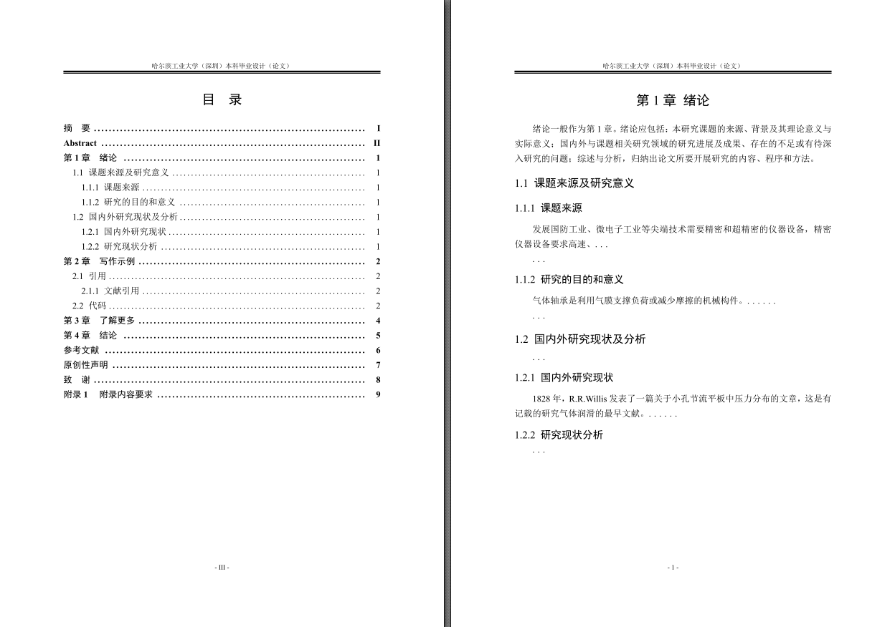

## What's This
**texshawn** 是哈尔滨工业大学（深圳）本科生毕业论文的**Latex** 模板。

[**Demo**](./main.pdf)可参考项目根目录下的pdf文件。该模板是本人自用模板，如有需要可自行修改并使用。

下面是几张样图：





## Download
```shell-session
git clone https://github.com/lazyshawn/texshawn.git
```

## Documentation
该项目文件结构：
```git
├─ style
│  ├─ preamble.tex          % 导言区设置
│  ├─ texshawn.cls          % 文档类
│  └─ texshawn.cfg          % 文档类常量设置
│
├─ contents
│  ├─ chapter01             % 第一章内容
│  │  ├─ pics
│  │  └─ chapter-01.tex
│  │
│  ├─ refs
│  │  ├─ reference.bib      % 参考文献.bib
│  │  └─ ref.tex            % 手动编写的参考文献
│  │
│  ├─ appendices
│  │  └─ appendix-01.tex    % 附录
│  │
│  ├─ abstract.tex          % 摘要
│  ├─ ...
│  └─ acknowledgment.tex    % 致谢
│
├─ main.tex                 % 主函数
├─ build.sh                 % 编译
├─ clean.sh                 % 清理过程文件
├─ ...
└─ README.md
```
根目录中`main.tex`为主函数，其中已经按目录将文章划分为若干分区，分区内容在`contents`文件夹下。模板文件在文件夹`style`中，可根据需求自行修改；`preamble.tex`为导言区设置，用于声明用户需要的宏包、命令等。根目录中的脚本文件尚未系统地编写，运行后在当前路径下生成pdf文件。

## Code & Compile
1. 进入`main.tex`，注释或删除不需要的内容。
2. 进入`preamble.tex`，编写个性化的宏包、常量、命令以及全局设置。
3. 进入`mian.tex`，依次编写各个分区的内容。
4. 请使用**xelatex**编译，或运行`build.sh`。

## Features
*
*

## Todos
* [ ] Finish the Demo and Userguide.
* [ ] Compile scripts.
* [ ] Citation format of subfloat (use \subref).
* [ ] Adjust page layout more precisely.

